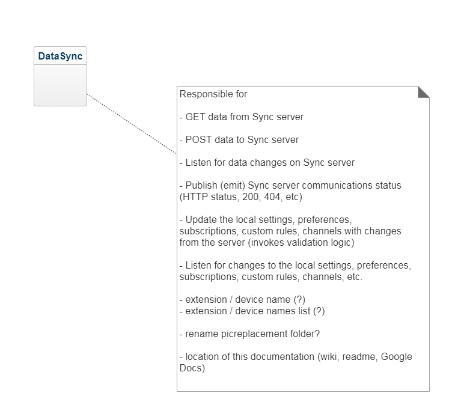
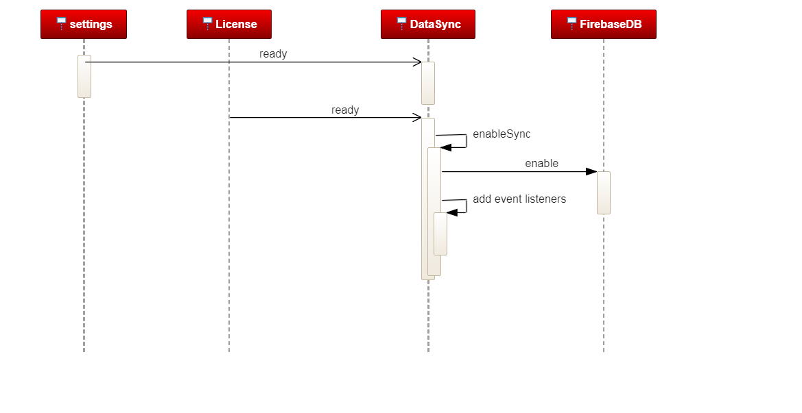
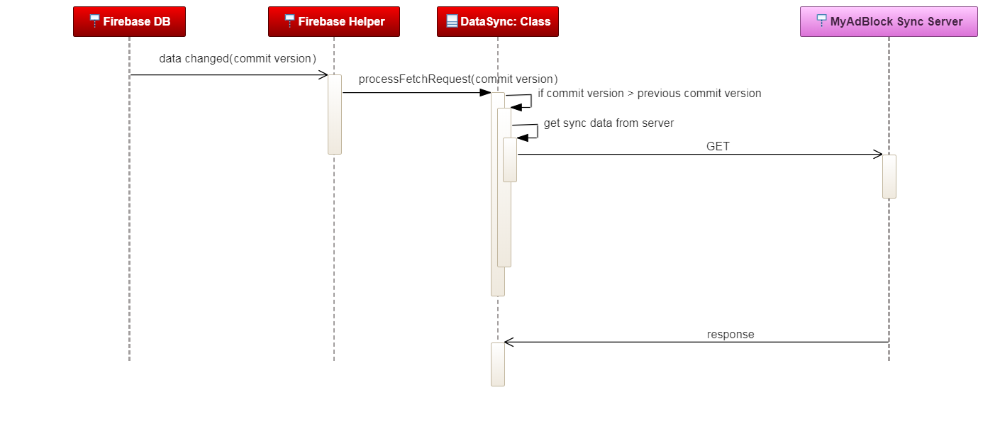
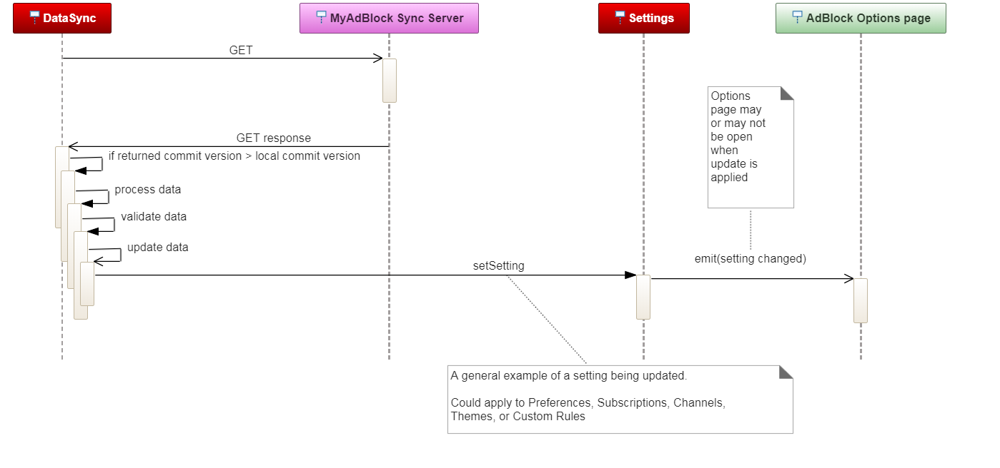
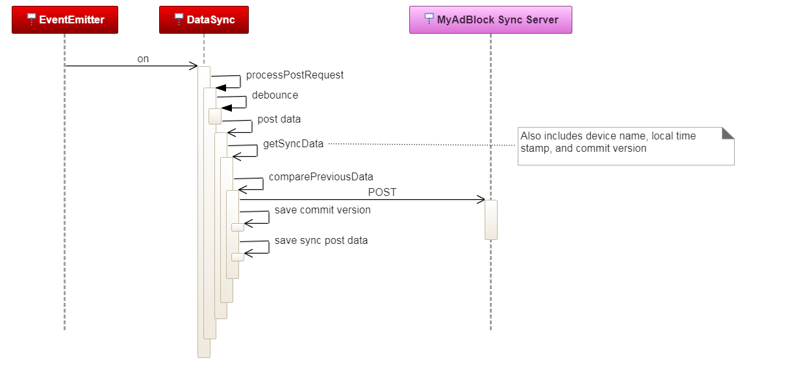
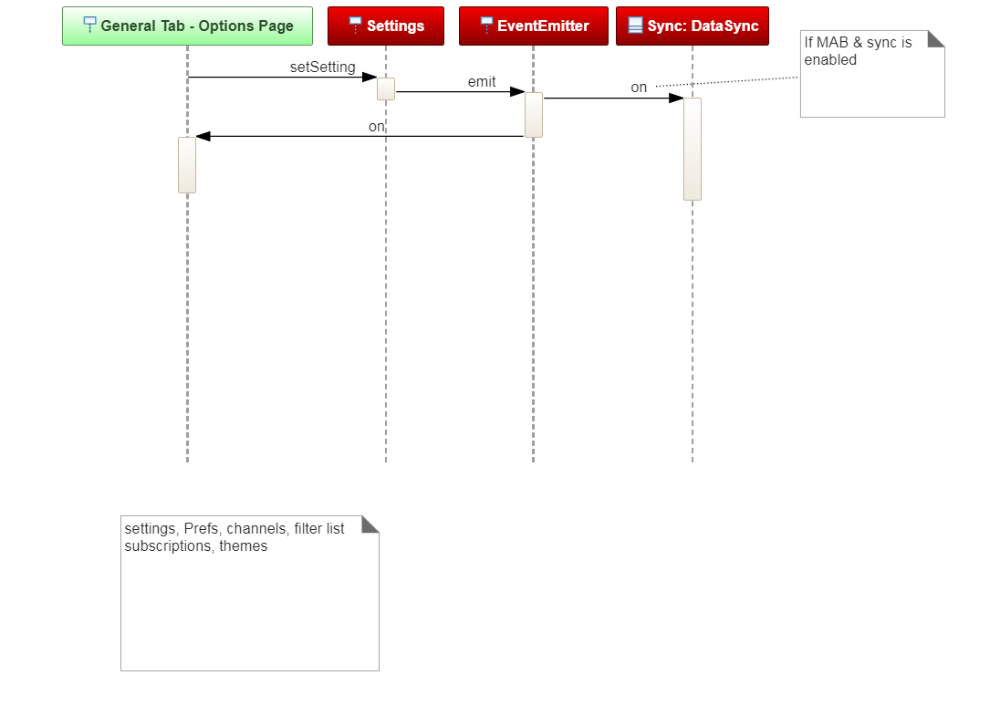
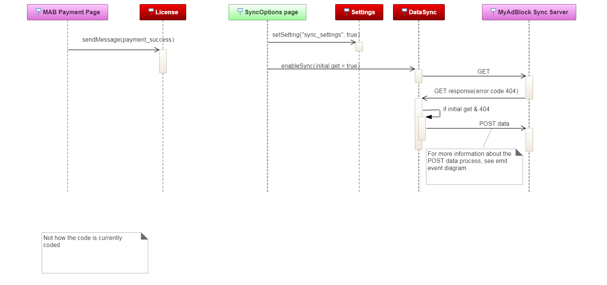
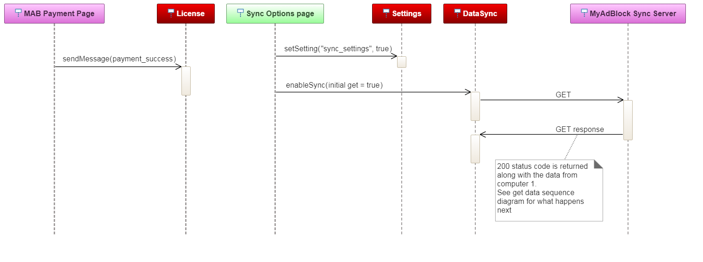

# Sync technical implementation

The following document will provide some information regarding the technical implementation of the ‘sync’ feature within AdBlock for Chrome (next gen repo).

Introduction
The Sync feature should allow a user to synchronize their AdBlock settings, subscriptions, custom filters, image replacement channels and ABP preferences between multiple devices.  In other words, any setting a user can change on the AdBlock Options page should be sync'd.

The following use case is similar to the Data Sync user case.  If a user has opened the AdBlock options page twice within the same browser session, then all changes made in one tab should be be reflected in the other tab.  In other words, if a setting, subscription, custom filters, image replacement channel, theme or preference is changed on one tab / options page, then the second (or all other open options pages) should show the same update(s) or changes immediately.

Intra Extension Communication
ABP has an EventEmitter (aka notifiers) object which provides a simple custom event processing within the extension.  The EventEmitter / Notifier objects are currently utilized on the filter list and customize tabs to receive updates to filter list subscriptions and/or custom rules.

EventEmitter / Notifiers will be utilized to communicate other AdBlock specific settings changes, such as items on the general tab, themes, and image replacement options.

Since the notifiers are now part of the set operation the Settings and Channel objects, updates to all attributes of these objects should utilize the setSetting() and setEnabled() functions, so that all listeners are informed of the updates.

The data sync service is a new object then will provide the interface between the extension and the backend servers (aka iAdBlockCloud).

Below are Sequence Diagrams that show some typical processing within the extension related to data sync processing.

Below is the color legend used on the sequence diagrams

# Current Sync structure

A JSON object with the following keys
    "data": Stringified JSON object, see details below
    "commitVersion": Integer: the current commit version known to this extension (provided by and updated by the sync server)
    "extensionGUID": String: the unique user id of extension (generated by the extension)
    "licenseId": String: a unique identifier provided by the license server (the primary key which the sync service links all corresponding extensions / devices)

The current data or payload containing the extension configuration items
  "settings": JSON object contain all of the current settings.  The keys are the settings keys
  "subscriptions": JSON object containing the current subscribed filter lists.  The keys are the ids of the filter lists
  "customFilterRules": A string containing all of the user enterred custom rules (line delimited).  Should not contain the pause or domain pause entries
  "prefs": JSON object containing 4 of the current ABP Preferences.  The keys are ['show_statsinicon', 'shouldShowBlockElementMenu', 'show_statsinpopup', 'show_devtools_panel']
  "channels": JSON object containing the pic replacement channels settings.  The keys are the three channel names

Note: The sync server doesn't modifiy, or change the payload data with the exception of the custom filter rules string.

The sync server will attempt to do a merge of custom filter rules strings if an older commit version is 'posted' to the sync server.  This merge may fail, and the extension (and then the user) will be notified via an error message on the options page and the popup menu.  If the merge succeeds, no error code will be returned to the extension.

# Testing hints:

- Use the following snippet to enroll in MAB:
  `License.checkPingResponse(JSON.stringify({ "myadblock_enrollment": true }));`

- Use the following snippet to change in extension memory sync commit version:
  `SyncService.setCommitVersion(1);`

  Setting the sync commit version to a lower value is one way to cause sync post errors (Error Code 409)

- Use the following code to change the stored user id:
  `storageSet(STATS.userIDStorageKey, "bad");`
  `chromeStorageSetHelper(STATS.userIDStorageKey, "bad");`

  The extension will need to be reloaded in the browser (the ping / STATS ping logic reads the user from storage at start up).
  Changing the user ID / GUID is one way to cause sync post and get errors (guid_not_in_group error code 401)

- Use the following code to change the loaded license id:
  `var theLic = License.get();`
  `theLic.code = "test1";`
  `theLic.licenseId = theLic.code;`
  `License.set(theLic);`

Changing the license id is one way to cause sync post and get errors (license_not_found error code 404)

Note: In the Sync MVP, many 'GET' errors are not shown to the user.
